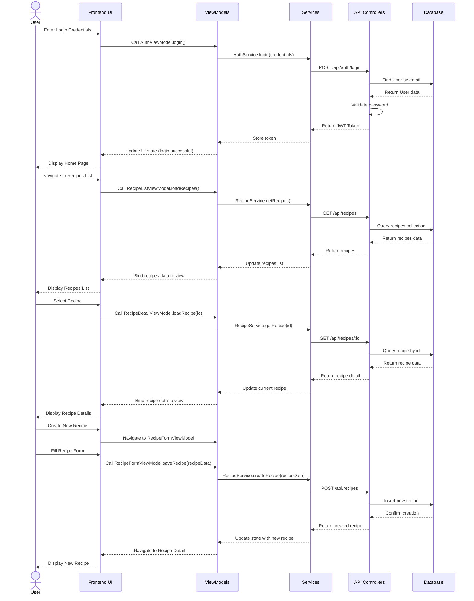

# Sprint 0: Project Setup & Design Planning

## Goals
- Set up the development environment
- Plan the application architecture
- Create initial design artifacts

## Design Approach

### 1. Domain Model
Start by modeling the core entities and their relationships:

- **Recipe**
  - Properties: id, title, description, ingredients, instructions, cookingTime, servingSize, createdBy, createdAt, updatedAt
  - Relationships: belongs to User

- **User**
  - Properties: id, email, password, name, createdAt
  - Relationships: has many Recipes

- **Ingredient**
  - Properties: id, name, quantity, unit, recipeId
  - Relationships: belongs to Recipe

### 2. Component Hierarchy
Define the UI component structure:

- **App** (root component)
  - **Layout** (header, footer, navigation)
  - **Pages**
    - **Home**
    - **RecipeList**
      - **SearchBar**
      - **RecipeCard** (multiple)
    - **RecipeDetail**
    - **RecipeForm** (create/edit)
    - **Login**
    - **Register**

### 3. API Design
Plan the backend API endpoints:

- **Recipes**
  - GET /api/recipes - List all recipes
  - GET /api/recipes/:id - Get single recipe
  - POST /api/recipes - Create recipe
  - PUT /api/recipes/:id - Update recipe
  - DELETE /api/recipes/:id - Delete recipe
  - GET /api/recipes/search?q=query - Search recipes

- **Auth**
  - POST /api/auth/register - User registration
  - POST /api/auth/login - User login
  - POST /api/auth/logout - User logout

## Main Class
### User
Represents a registered user of the application
Core attributes: id, email, password, name, createdAt
Relationships: one-to-many with Recipe (has many recipes)
### Recipe
Represents a cooking recipe created by a user
Core attributes: id, title, description, instructions, cookingTime, servingSize, createdBy, createdAt, updatedAt
Relationships: many-to-one with User (belongs to a user)
Contains a list of ingredients
### Ingredient
Represents a food item used in a recipe
Core attributes: id, name, quantity, unit, recipeId
Relationships: belongs to a Recipe

## Class UML

### Component Diagram

## Sequence Diagram
